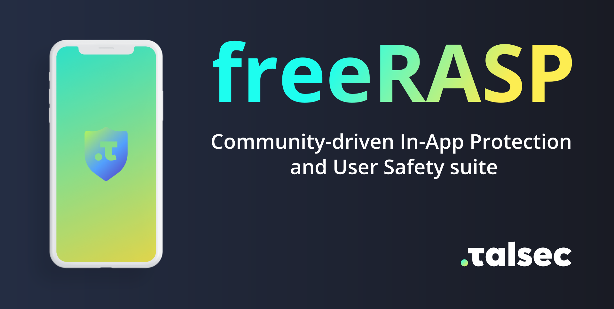
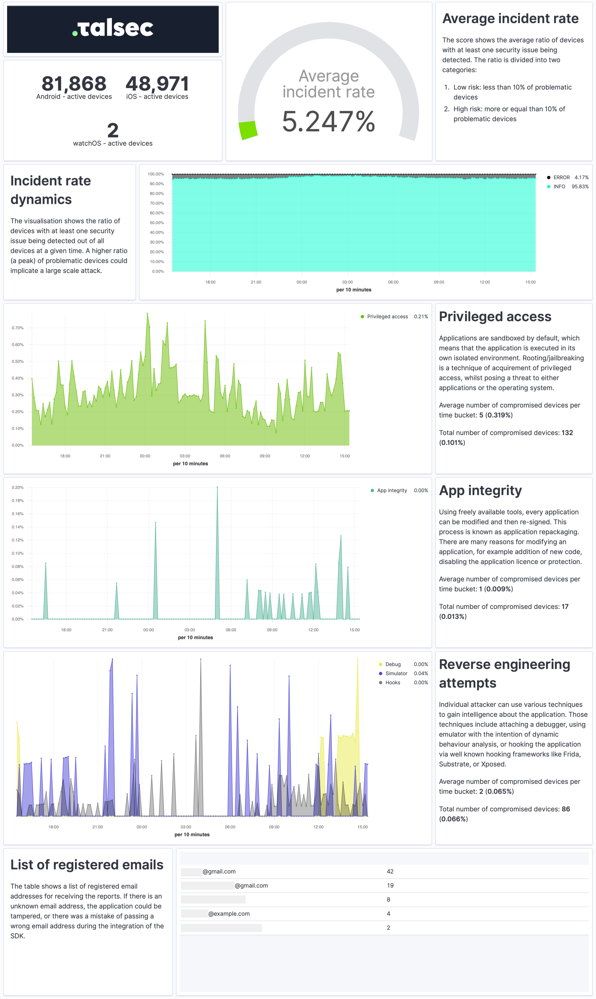

<h1 align=center>

</h1>

    
    
    

# Overview
freeRASP provides multiplatform mobile all-in-one protection for mobile applications free of charge.

**The protection features**:

:heavy_check_mark: Tamper protection

:heavy_check_mark: Repackaging/Cloning protection

:heavy_check_mark: Runtime analysis protection

:heavy_check_mark: Threat alerts & weekly security reports

The core of freeRASP is a security library which is freely distributed for all mobile platforms. The compiled library is part of a sample application together with an integration manual.

Check platform-specific submodule for details:
* [Flutter](https://github.com/talsec/Free-RASP-Flutter)
* [Android](https://github.com/talsec/Free-RASP-Android)
* [iOS](https://github.com/talsec/Free-RASP-iOS)

## Key Benefits
* Reactions to attacks and detected security threats via an API
* Alerts for critical incidents like app tampering and cloning
* Simple download and install with clear source code snippets
* Weekly security report via email indicating security status of devices and app integrity
* Fullfills OWASP Code Tampering and Reverse Engineering measures

# Cloud Services
Cloud services are shared both for Android and iOS. Cloud services (ie. reports and email alerts) for freeRASP are provided by Talsec free of charge. However freeRASP currently does not support self-hosted cloud service.

* Anonymized data logs are sent to ElasticSearch
* Data are continuously evaluated and ML-classified to detect anomalies
* Each account can set up a Watcher to receive weekly alerts about detected attempts for app modifications

## Processed data and GDPR compliancy
Talsec collects and analyzes device data to lower the risk of security issues, mitigate attacks, provide a possibility to investigate an attack, and provide security reports and attack watchers. Data created by freeRASP are anonymized. Nevertheless, don't forget you still have to specify freeRASP (https://talsec.app) in your Terms and Conditions as 3rd party data processor to be GDPR compliant. Data won't be provided to any other party. Also include the collected data in the privacy policy. It is also important to include the information about data collection in the corresponding application store, more on the matter in the integration manual of given platform.

### Processed Data
* Anonymous device identifier
* Security diagnostics data (e.g., indication of rooted device, indication of running in emulator)
* Security settings data (e.g., indication of turned off screen lock)
* Potentially harmful app metadata (e.g., package name)
* Signing certificate
* Publisher data (email) - used for sending reports

## Security Report
The Security Report comes with Incident rate dynamics, Root/Jailbreak, Tamper/Cloning, RE attempts and many other types of security information you can further investigate to protect your app and users.

_The value of email field in Talsec's config (check platform-specific submodule for more info) is automatically used as target address for your security reports. Email has a strict form `'name@domain.com'`._

<h1 align=center>

</h1>

# Community Development
Contributions are welcomed. Protections currently in place need to be continuously updated as new threats arise. You can start contributing in many different ways:
* Filing or reporting issues
* Working on one of the existing issues
* Browsing existing code and manuals and proofreading it
Support and maintenance is in the hands of the community. Feel free to open issues and ask questions.

# About Us
Talsec is an academic-based and community-driven mobile security company. We deliver in-App Protection and a User Safety suite for Fintechs.

We bridge the gaps between the user's perception of app safety and the strong security requirements of the financial industry. 

Talsec freeRASP provides a commercial-grade easy-to-integrate mobile security SDK that actively protects apps from attacks. SDK interacts with an on-line app security service that generates regular status reports, detects attacks and triggers watchdog notifications to app developers.

The freeRASP is available for Android and iOS developers. We encourage community contributions, investigations of attack cases, joint data researches and other activities aiming to make bettera app security and app safety for end-users.

# Enterprise Services
We provide extended services (ie. malware detection, detailed configurable threat reactions, immediate alerts and penetration testing) to our commercial customers with a self-hosted cloud platform as well. To get the most advanced protection compliant with PSD2 RT and eIDAS and support from our experts contact us at https://talsec.app.

**TIP:** You can try freeRASP and then upgrade easily to an enterprise service.

## Plans Comparison
<table>
    <thead>
        <tr>
            <th></th>
            <th>freeRASP</th>
            <th>Premium</th>
            <th>Business</th>
            <th>Enterprise</th>
        </tr>
    </thead>
    <tbody>
        <tr>
            <td>Number of active devices </td>
            <td>unlimitted (monitoring up to 100k)</td>
            <td>up to 10&nbsp;000k </td>
            <td>unlimitted</td>
            <td>unlimitted</td>
        </tr>
        <tr>
            <td colspan=5><strong>Runtime App Self Protection (RASP, app shielding)</strong></td>
        </tr>
        <tr>
            <td>Advanced root/jailbreak protections</td>
            <td>basic</td>
            <td>standard</td>
            <td>advanced</td>
            <td>custom</td>
        </tr>
        <tr>
            <td>Runtime reverse engineering controls  
                <ul>
                    <li>Debug</li>
                    <li>Emulator</li>
                    <li>Hooking protections</li>
                </ul>
            </td>
            <td>basic</td>
            <td>standard</td>
            <td>advanced</td>
            <td>custom</td>
        </tr>
        <tr>
            <td>Runtime integrity controls  
                <ul>
                    <li>Tamper protection</li>
                    <li>Repackaging / Cloning protection</li>
                    <li>Device binding protection</li>
                </ul>
            </td>
            <td>basic</td>
            <td>standard</td>
            <td>advanced</td>
            <td>custom</td>
        </tr>
        <tr>
            <td>Device OS security status check  
                <ul>
                    <li>HW security module control</li>
                    <li>Device lock control</li>
                    <li>Device lock change control</li>
                </ul>
            </td>
            <td>yes</td>
            <td>yes</td>
            <td>yes</td>
            <td>custom</td>
        </tr>
        <tr>
            <td>UI protection  
                <ul>
                    <li>Overlay protection</li>
                    <li>Accessibility services protection</li>
                </ul>
            </td>
            <td>no</td>
            <td>yes</td>
            <td>yes</td>
            <td>custom</td>
        </tr>
        <tr>
            <td colspan=5><strong>Hardening suite</strong></td>
        </tr>
        <tr>
            <td>Security hardening suite  
                <ul>
                    <li>Dynamic certificate pinning</li>
                    <li>Obfuscation</li>
                    <li>Secure storage hardening</li>
                    <li>Secure pinpad</li>
                </ul>
            </td>
            <td>no</td>
            <td>no</td>
            <td>yes</td>
            <td>yes</td>
        </tr>
        <tr>
            <td colspan=5><strong>Attestation and API protection</strong></td>
        </tr>
        <tr>
            <td>Device attestation and dynamic API protection</td>
            <td>no</td>
            <td>no</td>
            <td>no</td>
            <td>yes</td>
        </tr>
        <tr>
            <td colspan=5><strong>Monitoring</strong></td>
        </tr>
        <tr>
            <td>AppSec regular email reporting</td>
            <td>yes (up to 100k devices)</td>
            <td>yes</td>
            <td>yes</td>
            <td>yes</td>
        </tr>
        <tr>
            <td>Data insights and auditing portal</td>
            <td>no</td>
            <td>yes</td>
            <td>yes</td>
            <td>yes</td>
        </tr>
        <tr>
            <td>Embed code to integrate with portal</td>
            <td>no</td>
            <td>no</td>
            <td>yes</td>
            <td>yes</td>
        </tr>
        <tr>
            <td>API data access</td>
            <td>no</td>
            <td>no</td>
            <td>yes</td>
            <td>yes</td>
        </tr>
        <tr>
            <td>Data retention</td>
            <td>1 month</td>
            <td>1 month</td>
            <td>1 year</td>
            <td>custom</td>
        </tr>
        <tr>
            <td colspan=5><strong>Malware detection</strong></td>
        </tr>
        <tr>
            <td>SDK for Malware detection and backend monitoring</td>
            <td>no</td>
            <td>optional</td>
            <td>optional</td>
            <td>optional</td>
        </tr>
        <tr>
            <td colspan=5><strong>User Safety suite</strong></td>
        </tr>
        <tr>
            <td>SDK API for Safety Dashboard for end-users</td>
            <td>min</td>
            <td>min</td>
            <td>yes</td>
            <td>yes</td>
        </tr>
        <tr>
            <td>User Safety Assurance service (Improvement plan report, Top10 tips, hot attacks info)</td>
            <td>no</td>
            <td>no</td>
            <td>basic</td>
            <td>custom</td>
        </tr>
        <tr>
            <td colspan=5><strong>Deployment</strong></td>
        </tr>
        <tr>
            <td>Individual unique SDK build</td>
            <td>no</td>
            <td>yes</td>
            <td>yes</td>
            <td>yes</td>
        </tr>
        <tr>
            <td>Private cloud cluster</td>
            <td>no</td>
            <td>no</td>
            <td>no</td>
            <td>custom</td>
        </tr>
        <tr>
            <td colspan=5><strong>Platforms</strong></td>
        </tr>
        <tr>
            <td>Native (iOS and Android)</td>
            <td>yes</td>
            <td>yes</td>
            <td>yes</td>
            <td>yes</td>
        </tr>
        <tr>
            <td>Flutter (multiplatform)</td>
            <td>yes</td>
            <td>yes</td>
            <td>custom</td>
            <td>custom</td>
        </tr>
    </tbody>
</table>
