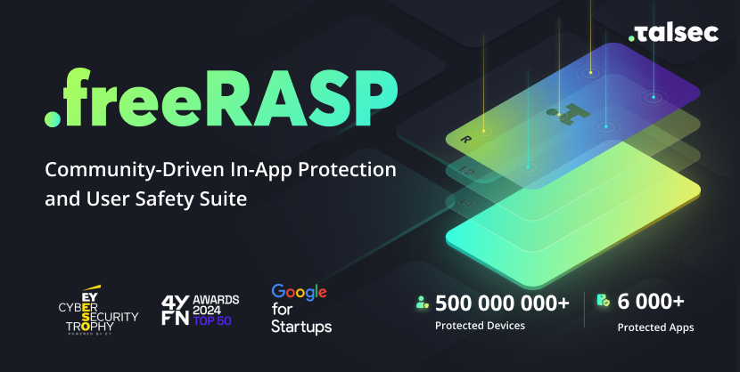

<h1 align=center>

</h1>

    

# freeRASP
In-App protection is a mobile security technology that allows mobile applications to check the security state of the environment they run within, actively counteract attack attempts, and control the integrity of the app. Such technology is also called RASP (Runtime App Self Protection) or App Shielding. 

freeRASP is a mobile in-app protection and security monitoring SDK. It aims to cover the  main aspects of RASP and application shielding.

:loudspeaker: The official documentation has been moved to a new location. You can now find it [here](https://docs.talsec.app/docs-and-articles-portal). :loudspeaker:

# Overview
The freeRASP is a lightweight and easy-to-integrate security library designed to protect apps from potential  threats during their runtime. It contains multiple security checks, each aimed to cover a possible attack vector to ensure a high level of application security. Among other options, it is able to detect reverse engineering, repackaging or cloning attempts, and running in an unsafe OS environment. It is freely distributed for all mobile platforms and is also available for Flutter, Capacitor, Cordova and React Native developers. 

You can check platform-specific submodules for the installation guide and specific details down below:
* [Flutter](https://github.com/talsec/Free-RASP-Flutter) ([pub.dev package](https://pub.dev/packages/freerasp))
* [Capacitor](https://github.com/talsec/Free-RASP-Capacitor)
* [React Native](https://github.com/talsec/Free-RASP-ReactNative)
* [Cordova](https://github.com/talsec/Free-RASP-Cordova)
* [Android](https://github.com/talsec/Free-RASP-Android)
* [iOS](https://github.com/talsec/Free-RASP-iOS)

### Key advantages
* Reactions to attacks and detected security threats via an API
* Simple download and install with clear source code snippets
* Insignificant effect on the app performance
* Weekly security report via email indicating security status of devices and app integrity
* Fulfills [OWASP MASVS V8: Resiliency Against Reverse Engineering Requirements](https://mobile-security.gitbook.io/masvs/security-requirements/0x15-v8-resiliency_against_reverse_engineering_requirements)

##  :dart: Features
freeRASP **provides protection** against potentially dangerous behavior,  including the following:

:heavy_check_mark: Using rooted or jailbroken devices (e.g., su, Magisk, unc0ver, check1rain, Dopamine)

:heavy_check_mark: Reverse engineering attempts

:heavy_check_mark: Running hooking frameworks (e.g., Frida, Xposed or Shadow)

:heavy_check_mark: Tampering or repackaging the  application

:heavy_check_mark: Installing the app through untrusted methods/unofficial stores

Visit our [wiki](https://docs.talsec.app/freerasp/wiki) to learn more details about the performed checks and their importance for app security.

## :radioactive: freeMalwareDetection
**freeMalwareDetection** is a powerful feature designed to enhance the security of your Android application by quickly and efficiently scanning for malicious or suspicious applications (e.g. Android malware) based on various blacklists and security policies. It helps to detect apps with suspicious package names, hashes, or potentially dangerous permissions.

After the integration of freeRASP, make sure you visit the [freeMalwareDetection](https://github.com/talsec/freeMalwareDetection) repository to learn more about this feature!

# :book: Discover the Official freeRASP Documentation
Visit the [GitBook page](https://docs.talsec.app/freerasp) for comprehensive and up-to-date guides, tutorials, and technical documentation specifically for freeRASP.
Whether you're just starting out or looking for advanced tips to enhance your project, you'll find everything you need here.

## :link: Integration Guide
For a seamless integration experience, follow the steps provided in the [Integration Guide](https://docs.talsec.app/freerasp/integration). This guide offers detailed instructions to ensure a smooth and efficient process, no matter what platform you're working with.

Make sure to bookmark the page and stay updated :books: :sparkles:!

# :rocket: What's New and Changelog
Stay informed and make the most of freeRASP by checking out [What's New and Changelog](https://docs.talsec.app/freerasp/whats-new-and-changelog)! Here, you’ll discover the latest features, enhancements, and bug fixes we’ve implemented to improve your experience across all platforms, including Android, iOS, Flutter, React Native, Capacitor, and Cordova. 

Don’t miss out on any updates and explore the changelog to see how we’re continually making freeRASP better for you!

# :sparkles: Enhancements

If you have any ideas for improvements, feel free to [raise an issue](https://github.com/talsec/Free-RASP-Community/issues) and mark it with an **enhancement** label. We track these enhancements using [GitHub Projects](https://docs.github.com/en/issues/planning-and-tracking-with-projects/learning-about-projects/about-projects) to keep tasks organized and connected to relevant issues or pull requests.

You can check out the project board [here](https://github.com/orgs/talsec/projects/2).

# :page_facing_up: License
This project is provided as freemium software, i.e. there is a [fair usage policy](https://docs.talsec.app/freerasp/features-and-pricing-plans#plans-comparison) that imposes some limitations on the free usage. The SDK software consists of open-source and binary parts, which is the property of Talsec. The open-source part is licensed under the MIT License - see the LICENSE file for details.
